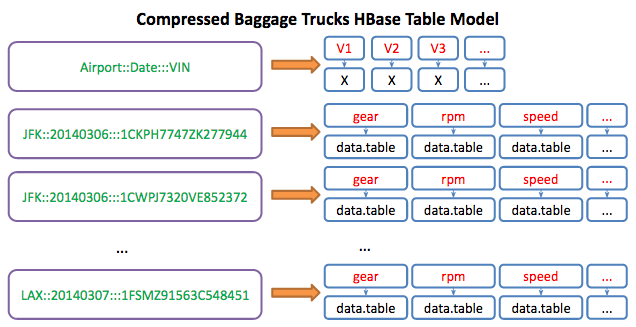

###Intro
Hello, and welcome to a brief introduction to HBase by way of R. This tutorial is aimed at explaining how you can use R through the rhbase package. However, it will use my little custom addition to rhbase which is geared towards using tidyr principals and data.tables/data.frames. Other differences include:

1. Standardized row-key serialize (raw data type)
2. sz and usz functions only apply to the actual data instead of row-key
3. hb.put - wrapper around hb.insert for easier inputting
4. hb.pull - wrapper around hb.scan for easier retrieval

So what will you get out of this? Good question. It is broken down into three parts:

1. Getting HBase, Thrift, and rhbase installed and working + brief intro + data intro
2. Inserting Data into HBase + HBase Basic Design/Modelling 
3. Retrieving Data from HBase, doing calculations, and inserting calculations

###So what is HBase Anyway?
Hopefully you have some knowledge of what HBase is, because after all, you are reading this. By no means will I attempt to explain all of HBase, but here is a brief attempt to summarize the mammoth:

**Wikipedias definition**: HBase is an open source, non-relational, distributed database modeled after Google's BigTable and written in Java. It is developed as part of Apache Software Foundation's Apache Hadoop project and runs on top of HDFS (Hadoop Distributed File system), providing BigTable-like capabilities for Hadoop.

**From From http://hbase.apache.org/** “Use Apache HBase when you need **random, realtime read/write access** to your Big Data. This project's goal is the hosting of very large tables -- **billions of rows X millions of columns** -- atop clusters of commodity hardware. Apache HBase is an **open-source, distributed, versioned, non-relational database** modeled after Google's Bigtable... Just as Bigtable leverages the distributed data storage provided by the Google File System, Apache HBase provides Bigtable-like capabilities **on top of Hadoop and HDFS**.”

Clearly with those definitions you should know what HBase is now right? If you're like me, a little more explanation is helpful. To start wrapping your head around NoSQL and HBase, here is a 5-step progression that I have found helpful:

1. A Key-Value Store
  - At its core, that's all HBase really is. Its a map, a dictionary (python), a hash (ruby), etc... 
2. Distributed
  - HBase sits atop a Hadoop Cluster. Basically what that means from HBase's perspective is that the data in HBase is replicated out to, by default, 3 nodes in a Hadoop Cluster. 
  - Based on the assumption that servers go down and bad things happen
  - A full implementation relies on HDFS, Zookeeper, and your HBase region master(s)
3. Consistent
  - HBase is (at least as of right now) an immediate consistent database. That means that HBase guarantees your data to be the exact same on any of the nodes that it is replicated to. 
  - See CAP Theorem for more information on Consistent, Available, and Partition tolerant databases (Cassandra, a similar NoSQL Columnar Database emphasizes Availability over Consistency)
4. Sorted
  - The Keys in this key-value store are stored alphabetically
  - Designed for faster reads than writes
  - Allows the concepts of "scanning" to exist
5. Multi-Dimensional
  - Remember how it is a key-value store. Well, really, its more like a key-column-value store, or Map of Maps
  - This is what is referred to as "columnar" or "wide rows"
  - For any given key, allows you to store any amount of information
  - Schema-less - your key-column-value combination can be defined at any time and does not naturally conform to any schema


###HBase Frame of Mind
  - First there is a HBase **table**, which is exactly what you would think it is... a table
  - Within a table are **column families**, which is basically just a subgroup of your table. Best practice is to limit the number and size of these. So, if you are new to HBase, just pretend you only have 1 as in most cases that is all that is necessary. 
  - All data is then accessed via a **rowkey**, which is essentially your indexing mechanism (enter row-key or range of row-keys, and BLAM, data). This is also your key in "key-column-value" as depicted earlier
  - Within a given row, there can be potentially millions of columns. This is the concept of **wide rows**. Although it can certainly be used for many things, time-series data is a good use case as it allows you to store a time values as column values, and then the variable value in a cell (the variable name would be in the row key). This concept is often hard to grasp the first time, so I have provided some visuals to help explain it. Many people's breakthrough on this concept is often when they realize that values are/can be stored as columns. 
  - Schema less. You do not need to add columns in advance ever, you can simply do it on the fly. However, is advised that you keep record or develop a scheme of how you are storing data as the actual retrieval will be made very difficult if you have no idea whats in there.
  - Data modeling: **Based off query patterns and stored directly**. Cross-table joins are a BAD thing (Spark can help with this). Essentially you are sacrificing complex querying for huge speed gains.

So hopefully that helped, and if not, there is plenty of information out there about HBase and what it does. Here are a few links:

- [Apache HBase](http://hbase.apache.org/)
- [Wikipedia](http://en.wikipedia.org/wiki/Apache_HBase)
- [Hortonworks](http://hortonworks.com/hadoop/hbase/)

###Installing HBase and rhbase
In order to use this stuff, you have to install HBase, thrift (yes, sorry, it uses thrift), and the rhbase. The basic instructions are found [here](https://github.com/RevolutionAnalytics/RHadoop/wiki/user-rhbase-Home), but if you are trying to get up and running as soon as possible, here are a few helpful hints:

1. Install Thrift following this [guide](http://thrift.apache.org/docs/install/)
2. Update PKG_CONFIG_PATH: export PKG_CONFIG_PATH=$PKG_CONFIG_PATH:/usr/local/lib/pkgconfig/
3. Verify pkg-config path is correct: pkg-config --cflags thrift , returns: -I/usr/local/include/thrift
4. Copy Thrift library sudo cp /usr/local/lib/libthrift-0.8.0.so /usr/lib/ 
5. Install HBase following Apache's quick start [guide](http://hbase.apache.org/book.html#quickstart)
6. Start up HBase and Thrift
```
[hbase-root]/bin/start-hbase.sh
[hbase-root]/bin/hbase thrift start
```
7. Now download and install the package with devtools (or get a tarball copy [here](https://github.com/aaronbenz/rhbase/tree/master/pkg)

###Test it out
Hopefully you were able to install rhbase. Provided that you were, try out this code to make sure it works. If you can run this successfully, then you have successfully installed HBase and the rhbase package.
```{r}
require(rhbase)
library(data.table)
hb.init()
```

###Understanding Our Fake Data
The fake data that is being supplied is time-series data taken from airport support vehicles (like a baggage truck) from various airports over a small period of time. The data is stored hierarchically as: Airport_Day_VehicleIDNum_Variable. You can retrieve a list of all of the data simply by loading it from the rhbase package:
```{r}
data(baggage_trucks)
str(baggage_trucks[1:3])
```

The three variables are ***gear***, ***speed*** (mph), and **rpm** (revolutions per minute of engine). With these variables, we are going to calculate the fuel rate of a vehicle. For more information about the data use `?baggage_trucks`

Note: Credit to Spencer Herath for creating the fake data set of trucks whizzing around an airport.

#Getting Data Into HBase with R
Ok, now its time to talk about actually putting some stuffing in the elephant. 

###HBase Table Design
Its important that we design our HBase table in a way that suites our query pattern. A NoSQL Columnar frame of mind is always ***Design Your Tables For Your Query Pattern***. Unlike a relational store, each table that is built is traditionally designed for one single type of query pattern (document stores like Solr or Elastic Search can provide you a backwards indexing solution. Overall, this can make your data modelling experience "simpler" in concept). This frame of mind implies that:

  * Joins are BAD (Spark does add some additional capability for this)
  * Avoid lookups as much as possible
  * Do all data transformations on the incoming stream versus the outgoing
  
Remember, the goal is to get the data out and delivered as soon as possible, so make sure that the data and the query patterns are designed for the end format, not the raw format.

Ok, now that my little rant is over with (don't worry, I'll mention this again later :)), lets get to the design of this HBase table. We know that our data is **by variable by vehicle by date** and that it is "de-duplicated" for compression purposes. Additionally, because this is archived data, we can further compress it to a binary blob aka byte array, drastically reducing the size of our data while immensely increasing the speed at which we retrieve it (because its just in one blob as opposed to many cells). However, we need to be cautious of the memory limitations that might exist; the size and number of blobs has to be manageable. That is, we need to retrieve our data in small enough partitions and still retrieve the right variables so that we can perform all of the functions necessary to calculate fuel usage. The basic query pattern we are creating is to be able to specify an airport and a date range, along with whatever variables are necessary. That brings us to this basic table structure:

  * row-key = airport::day::vin
  * column = variable
  * value = specific data.table
  



#####Create HBase Table
Now that the data model is defined, we need to create a table to use it. In this case, a table called `Test` with a column family called `test` is being created.
```{r, echo=FALSE}
hb.delete.table("Test")
```
```{r}
hostLoc = '127.0.0.1'  #Give your server IP
port = 9090  #Default port for thrift service
hb.init()
hb.list.tables()
TABLE_NAME = "Test"
COLUMN_FAMILY = "test"
hb.new.table(TABLE_NAME, COLUMN_FAMILY)
```

###Input Data into HBase
Now that we have our HBase table created, all that is left is actual putting the `baggage_trucks` data into HBase. To do this, we will use the convenient `hb.put` function. So lets take a look at what the data actually looks like:
```{r}
require(magrittr,quietly = T)
require(tidyr,quietly = T,warn.conflicts = F)
data(baggage_trucks)
dt_names <- names(baggage_trucks) %>%
  data.frame() %>%
  tidyr::separate(".",c("airport","date","vin","variable"))
dt_names <- dt_names %>% unite(rowkey,airport,date,vin, sep = "::")
head(dt_names)
```

####How `hb.put` Works
The design of `hb.put` is meant to be relatively simple and flexible. For a given table and column family, you can either create a list of "columns" and a list of "values" for each "row-key", or you insert it using a 1-1-1 ratio like this example will do. Just FYI, the first option is very useful and designed for inputting multiple columns into the same row-key (an uncompressed time-series use case).

```{r}
hb.put(table_name = TABLE_NAME,column_family = COLUMN_FAMILY, rowkey = dt_names$rowkey, column = dt_names$variable,value = baggage_trucks)
```


And just like that **BAMMM**, data is in HBase. Now, just to pause for a second, it might be important that you understand how data was put into HBase, as this is actually a modification I made from the original rhbase package. The row-keys are turned into byte arrays using the `charToRaw` method, essentially turning the character row-key into a raw binary data type. The data.tables are turned into byte arrays using R's native serializer. If you would like to use your own serializer for the actual data, input the data as raw (maybe because its already serialized), etc..., simply specify `sz = ` "raw", "character", or custom function in hb.put, OR specify it in the original `hb.init` function. Note: the row-key serializer is not editable at the moment.

  
####Examples Retrieving Data

1. Retrieving only from 03/06/2014 onward for LAX and for just the "Speed" variable
```{r}
hb.pull(TABLE_NAME, COLUMN_FAMILY, start = "LAX::20140306", end = "LAXa", columns = "speed", batchsize = 100)
```


2. Retrieving everything between 03/07/2014 and 03/08/2014 (so nothing on the 7th)
```{r}
hb.pull(TABLE_NAME, COLUMN_FAMILY, start = "LAX::20140307", end = "LAX::20140308",batchsize = 100)
```
