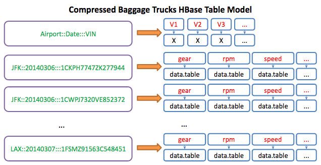

#Part I: Intro to HBase
Welcome to a brief introduction to HBase by way of R. This tutorial is aimed at explaining how you can use R through the rhbase package. However, it will use my little custom addition to rhbase which is geared towards using tidyr principals and data.tables/data.frames. Other differences include:

1. Standardized row-key serializer (raw data type)
2. sz and usz functions only apply to the actual data instead of row-key
3. hb.put - wrapper around hb.insert for easier inputting
4. hb.pull - wrapper around hb.scan for easier retrieval

So what will you get out of this? Good question. It is broken down into three parts:

1. Getting HBase, Thrift, and rhbase installed with a brief intro into HBase
2. Inserting Data into HBase + HBase Basic Design/Modelling 
3. Retrieving Data from HBase, doing calculations, and inserting calculations

###So what is HBase Anyway?
Hopefully you have some bare knowledge of what HBase is, because after all, you are reading this. By no means will I attempt to explain all of HBase, but here is a brief attempt to summarize the mammoth:

**Wikipedias definition**: HBase is an open source, non-relational, distributed database modeled after Google's BigTable and written in Java. It is developed as part of Apache Software Foundation's Apache Hadoop project and runs on top of HDFS (Hadoop Distributed File system), providing BigTable-like capabilities for Hadoop.

**From http://hbase.apache.org/** “Use Apache HBase when you need **random, realtime read/write access** to your Big Data. This project's goal is the hosting of very large tables -- **billions of rows X millions of columns** -- atop clusters of commodity hardware. Apache HBase is an **open-source, distributed, versioned, non-relational database** modeled after Google's BigTable... Just as BigTable leverages the distributed data storage provided by the Google File System, Apache HBase provides BigTable-like capabilities **on top of Hadoop and HDFS**.”

Clearly with those definitions you should know what HBase is now right? If you're like me, a little more explanation is helpful. To start wrapping your head around NoSQL and HBase, here is a 5-step progression that I have found helpful:

1. A **Key-Value Store**
  - At its core, that's all HBase really is. Its a map, a dictionary (python), a hash (ruby), etc... 
2. **Distributed**
  - HBase sits atop a Hadoop Cluster. Basically what that means from HBase's perspective is that the data in HBase is replicated out to, by default, 3 nodes in a Hadoop Cluster. 
  - Based on the assumption that servers go down and bad things happen
  - A full implementation relies on HDFS, Zookeeper, and your HBase region master(s)
3. **Consistent**
  - HBase is an immediately consistent database. That means that HBase guarantees your data to be the exact same on any of the nodes that it is replicated to. 
  - See CAP Theorem for more information on Consistent, Available, and Partition tolerant databases (Cassandra is a similar NoSQL Columnar Database emphasizing Availability over Consistency)
4. **Sorted**
  - The Keys in this key-value store are stored alphabetically
  - Designed for faster reads than writes
  - Allows the concepts of "scanning" to exist
5. **Multi-Dimensional Key-Value Store**
  - Remember how it is a key-value store. Well, really, its more like a key-column-value store, or a Map of Maps
  - This is what is referred to as "columnar" or "wide rows"
  - For any given key, it allows you to store any amount of information
  - Schema-less - your key-column-value combination can be defined at any time and does not naturally conform to any schema


###HBase Frame of Mind
  - First there is a HBase **table**, which is exactly what you would think it is... a table
  - Tables are organized by **column families**, which is basically just another container for your data. Best practice is to limit the number and size of these. So, if you are new to HBase, just pretend you only have 1 as in many cases that is all that is necessary. 
  - All data is then accessed via a **rowkey**, which is essentially your indexing mechanism (enter row-key or range of row-keys, and BLAM, data). This is also your key in "key-column-value" as depicted earlier
  - Within a given row, there can be potentially millions of columns. This is the concept of **wide rows**. Although it can certainly be used for many things, time-series data is a good use case as it allows you to store time values as column names, and then the variable value correlating to a particular timestamp is in a cell (the variable name would be in the row key). This concept is often hard to grasp the first time, so I have provided some visuals to help explain it. Many people's breakthrough on this concept is often when they realize that values are/can be stored as columns. 
  - **Schemaless*. You do not need to add columns in advance ever, you can simply do it on the fly. However, is advised that you keep record or develop a scheme of how you are storing data as the actual retrieval will be made very difficult if you have no idea whats in there.
  - Data modeling: **Based off query patterns and stored directly**. Cross-table joins are a BAD thing (Spark can help with this, but that does not mean your design should implementjoins). Essentially you are sacrificing complex querying for huge speed gains.

So hopefully that helped, and if not, there is plenty of information out there about HBase and what it does. Here are a few links:

- [Apache HBase](http://hbase.apache.org/)
- [Wikipedia](http://en.wikipedia.org/wiki/Apache_HBase)
- [Hortonworks](http://hortonworks.com/hadoop/hbase/)

###Installing HBase and rhbase
In order to use this stuff, you have to install HBase, Thrift (yes, sorry, it uses Thrift), and the rhbase package. The basic instructions are found [here](https://github.com/RevolutionAnalytics/RHadoop/wiki/user-rhbase-Home), but if you are trying to get up and running as soon as possible, here are a few helpful hints:

1. Install Thrift following this [guide](http://Thrift.apache.org/docs/install/)
2. Update PKG_CONFIG_PATH: export PKG_CONFIG_PATH=$PKG_CONFIG_PATH:/usr/local/lib/pkgconfig/
3. Verify pkg-config path is correct: pkg-config --cflags Thrift , returns: -I/usr/local/include/Thrift
4. Copy Thrift library sudo cp /usr/local/lib/libThrift-0.8.0.so /usr/lib/
  - **Under this implementation I would advise using Thrift 0.8.0 as the latest version might inclur some bugs**
5. Install HBase following Apache's quick start [guide](http://hbase.apache.org/book.html#quickstart)
6. Start up HBase and Thrift
```
[hbase-root]/bin/start-hbase.sh
[hbase-root]/bin/hbase Thrift start
```
7. Now download and install the package with devtools (or get a tarball copy [here](https://github.com/aaronbenz/rhbase/tree/master/pkg)

###Test it out
Provided HBase, Thrift, and rhbase are now installed correctly and are running, the code below should run successfully.
```{r}
library(rhbase)
library(data.table)
hb.init()
```

###Understanding Our Fake Data
The fake data that is being supplied in this tutorial is time-series data taken from airport support vehicles (like a baggage truck) from various airports over a small period of time. The data is stored hierarchically as: Airport_Day_VehicleID_Variable. You can retrieve a list of all of the data simply by loading it from the rhbase package:
```{r}
data(baggage_trucks)
str(baggage_trucks[1:3])
```

The three variables are ***gear***, ***speed*** (mph), and **rpm** (revolutions per minute of engine). With these variables, the goal is to calculate the fuel rate of a vehicle. For more information about the data use `?baggage_trucks`

Note: Credit to Spencer Herath for creating the fake data set of imaginary trucks whizzing around an invisible airport.

#Part II: Getting Data Into HBase with R
Ok, now it's time to talk about actually putting some stuffing in the elephant. 

###HBase Table Design
It's important that the design of the HBase table suites the desired query pattern(s). A NoSQL Columnar frame of mind is always ***Design Your Tables For Your Query Pattern***. Unlike a relational store, each table that is built is traditionally designed for one single type of query pattern (document stores like Solr or Elastic Search can offer a backwards indexing solution. Overall, this can make a data modeling experience "simpler" in concept). To recap slightly, this frame of mind implies that:

  * Joins are BAD
  * Avoid lookups as much as possible
  * Do all data transformations on the incoming stream versus the outgoing
  
Remember, the goal is to get the data out and delivered as soon as possible, so take special precaution to insure that the data and the query patterns are designed for the end format, not the raw format.

Currently the data in its raw format is **by variable by vehicle by date.** Additionally, because this is archived data, additionally compression to a binary blob(byte array) is achievable, drastically reducing the size of the data set while immensely increasing the speed at which it is retrieved (because its just in one blob as opposed to many cells). However, the approach should be cautious of the memory limitations that might exist; the size and number of blobs has to be manageable. That is, data needs to be retrieved in manageable partitions that contain all of the necessary variables to perform a fuel usage calculation. With those concepts in mind, the query pattern should be able to take on specific airports and date ranges, along with whatever variables that are desired. Thus:

  * row-key = airport::day::vin
  * column = variable
  * value = specific data.table
  



#####Create HBase Table
Now that the data model is defined, a table must be created to use it. In this case, a table called `Test` with a column family called `test`:
```{r, echo=FALSE}
hb.delete.table("Test")
```
```{r}
hostLoc = '127.0.0.1'  #Give your server IP
port = 9090  #Default port for Thrift service
hb.init()
hb.list.tables()
TABLE_NAME = "Test"
COLUMN_FAMILY = "test"
hb.new.table(TABLE_NAME, COLUMN_FAMILY)
```

###Input Data into HBase
Now that the HBase table is created, all that is left is actual putting the `baggage_trucks` data into HBase. This can be done with the convenient `hb.put` function:
```{r}
require(magrittr,quietly = T)
require(tidyr,quietly = T,warn.conflicts = F)
data(baggage_trucks)
dt_names <- names(baggage_trucks) %>%
  data.frame() %>%
  tidyr::separate(".",c("airport","date","vin","variable"))
dt_names <- dt_names %>% unite(rowkey,airport,date,vin, sep = "::")
head(dt_names)
```

####How `hb.put` Works
The design of `hb.put` is meant to be relatively simple and flexible. For a given table and column family, `hb.put` allows the creation of a list of "columns" and a list of "values" for each "row-key." This option is very useful and designed for inputting multiple columns into the same row-key (an uncompressed time-series use case). Additionally, `hb.put` allows the insertion of data using a 1-1-1 ratio like this example will do.
```{r}
hb.put(table_name = TABLE_NAME,column_family = COLUMN_FAMILY, rowkey = dt_names$rowkey, column = dt_names$variable,value = baggage_trucks)
```


And just like that, data is in HBase. Before proceeding further, it might be important that to understand how data was put into HBase, as this is actually a modification from the original rhbase package. The row-keys are turned into byte arrays using the `charToRaw` method, essentially turning the character row-key into a raw binary data type. The data.tables are turned into byte arrays using R's native serializer. If you would like to use your own serializer for the actual data, input the data as raw (maybe because its already serialized), etc..., simply specify `sz = ` "raw", "character", or custom function in hb.put, OR specify it in the original `hb.init` function. Note: the row-key serializer is not editable at the moment. The change to this branch was separating the serialization method for the row-keys from the values.

  
####Examples Retrieving Data
Now that data is inserted, here are some brief examples worth reviewing to understand how data can be retrieved from HBase with this package.

1. Retrieving only from 03/06/2014 onward for LAX and for just the "Speed" variable
```{r}
hb.pull(TABLE_NAME, COLUMN_FAMILY, start = "LAX::20140306", end = "LAXa", columns = "speed", batchsize = 100)
```


2. Retrieving everything between 03/07/2014 and 03/08/2014 (so nothing on the 7th)
```{r}
hb.pull(TABLE_NAME, COLUMN_FAMILY, start = "LAX::20140307", end = "LAX::20140308",batchsize = 100)
```


#Part III: Retrieve and Store
Ok, so now that data is in HBase, lets:

1. **Retrieve Data with rhbase**
2. **Manipulate Data using Tidyr + data.table + timeseriesr**
3. **Perform Calculations with timeseriesr**
4. **Store Our Results using rhbase**


##Retrieving Data with rhbase
From the HBase input tutorial, we stored data.tables via byte arrays in HBase (from hbase_input document). But what about getting it out? By using hb.pull, we will be able to pull our desired HBase data.

Going back to the use case at hand, our goal is to measure the total fuel consumption of these trucks present in the data. To do so, we need to call gear, rpm, and speed (the three variables we put in HBase) and apply a custom made fuel calculator in R. However, as mentioned previously, we need to be careful about how we bring data in, as too much data at one time could easily lead to memory problems.

Based on how we modeled our data, we are going to **retrieve ALL variables for ALL VINs by EACH day for EACH airport**. We can do this in HBase with the `scan` function. Recalling the description of HBase, all of the keys or row-keys are sorted alphabetically. This means that all of the data for 1 airport is stored next to each other. Additionally, because of our row-key, all of the data is sorted by Airport by Date. A scan operation will allow us to get back all of the data for 1 airport for 1 day in essentially 1 iop. That is, with one "scan" we can get all of the data because its located next to each other. So how can we do this in R:

We begin with a list of our airports:
```{r}
airports <- c("JFK","LAX")
```
Then we create a list of all the dates we want, which in this case is between the 6th and 8th of March 2014.
```{r}
start_dates <- paste0("2014030", 6:7)
end_dates <- paste0("2014030", 7:8)
```

Now lets create a function that will allow us to pull back all of the variables 1 VIN 1 Day at a time (this is done to demonstrate responsible memory management.)
```{r}
library(data.table)
rk_generator <- function(start, end, ...){
  function(x){
    data.table(start = paste(x,start, ...), end = paste(x,end,...))
  }
}

march <- rk_generator(start_dates, end_dates, sep = "::")
```

The functional `march` allows us to have all of the time stamps we want for each airport. For example:
```{r}
march(airports[1])
```

Don't you just love how easy R is? This output will feed our function to call HBase for each day for each airport. 


##Pull data, merge, and calculate
1. Bring in some data for 1 day
2. Merge the data together to do a proper fuel calculation of `gal_per_hr`, average speed, and time in use
3. Visualize some of the results

```{r}
a_day <- march(airports[1])[1]
```

OK, time to bring in some data
```{r}
library(rhbase)
library(magrittr)
hb.init()
data <- hb.pull("Test","test",start = a_day[[1]], end = a_day[[2]], columns = c("gear","rpm","speed"))
data[1:6]
```

And just like that, boom, data!!!!!

##Manipulate Data with Tidyr + data.table + timeseriesr


OK, lets do something with that stuff. Our goal is this: to combine the gear, rpm, and speed data.tables by VIN. Our basic steps to doing so:
1. Split the row key to make the values meaningful with tidyr
2. Combine data.tables with VIN in mind
3. Clean up merged data

1. Split with tidyr
```{r}
data <- data %>%
  tidyr::separate(col = "rowkey", into = c("airport","day","vin"))
data[1:5]
```

2. Combine by VIN + column with rbindlist
```{r}
#rbind by variable
setkeyv(data, c("vin", "column"))

merge_em <- function(values){
  if(length(values)<=1) return(values)
  out <- values[[1]]
  for(i in 2:length(values)){
    out <- merge(out,values[[i]],all=T,by = "date_time")
  }
  out
}
data2 <- data[,list("rbinded" = list(merge_em(values))),by=c("vin","day","airport")] #data.table functionality
data2$rbinded[[1]] %>% setDT
```
3. Clean up our data with timeseriesr. Essentially, because our time stamps for each variable were not guaranteed to match, we probably (and do) have NA values in each data set. This use of `dtreplace` will take any NA values and replace them with the Last Observation. 
```{r}
data2$rbinded <- data2$rbinded %>% lapply(timeseriesr::dtreplace)  %>% lapply(setDT)#fills in missing NAs
data2$rbinded[[1]]
```
4. Now lets see what this baby looks like:

```{r, echo=FALSE, warning=FALSE}
library(ggplot2)
plot_time_series <- function(data_table, time_variable = "time", y = "value", color_by = NULL, facet_by = NULL,facet_text_size = 10,title = paste(data_table$well_id[1])){
    if(!is.null(facet_by))data_table$facet_by_this <- data_table[[facet_by]]
    col <- rainbow(30)
    col.index <- ifelse(seq(col) %% 2, 
                        seq(col), 
                        (seq(ceiling(length(col)/2), length.out=length(col)) %% length(col)) + 1)
    mixed <- col[col.index]
    
    data_table[[time_variable]] <- as.POSIXct(data_table[[time_variable]], origin = "1970-01-01")
    p <- ggplot(data_table,aes_string(time_variable ,y, color = color_by))+
        geom_step()+
        
        facet_grid(facet_by_this~., scales = "free") +
        labs(title = title, x = 'Time', y = '' ,size = 10)+
        
        theme(
            panel.grid.minor = element_blank(), 
            panel.background = element_blank(),
            plot.background = element_blank()) +
        theme(text = element_text(size=facet_text_size)) +
        scale_color_manual(values=rep(mixed, length.out=nrow(data_table)))
    return(p)
    
}
tmp <- tidyr::gather(data2$rbinded[[1]],key = "variable",value = "value",-date_time)
plot_time_series(tmp, time_variable = "date_time",color_by = "variable", facet_by = "variable")
```

####Perform our calculations with timeseriesr

3.Now that we have our data in memory, lets do our calculation!!! Below is the a function that will be used to calculate the gal_per_hr from our 3 variables (rpm, gear, and speed) 
```{r}
#I basically estimated this by looking at some relations between acceleration, vehicle weight, torque, and all of the other things you see below on the magical world wide web
  
#calculates Fuel Usage by row, returns array of fuel usage
#engine power = torque * rpm / 5252
# The constant 5252 is the rounded value of (33,000 ft?lbf/min)/(2?? rad/rev).
#fuel usage: if Power < 0, alpha
#           : alpha + min(Pmax, engine power)
# alpha = constant idle fuel consumption rate (estimate of fuel sued to maintain engine operation)
# Pt = power = min(Pmax, torque + inertia(mass * radius^2))
gal_per_hr = function(engine_gear, engine_rpm, time, speed, alpha = .7, mass = 10000, gear_ratio = 1.2, Pmax =   200, efficiency_parameter = .02, acceleration_parameter = .01, wheel_radius){
    torque <- c(diff(engine_rpm),0)
    torque[torque<0] <- 0
    torque <- torque * engine_gear * gear_ratio
    Pt <- torque * engine_rpm / (33000/2/pi)
    Pt[Pt>200] <- 200
    engine_power <- t
    acceleration <- c(-diff(speed),0) / c(-diff(time),1) 
    #Pi = Mv(kg) * acceleration * velocity /1000
    fuel <- alpha + efficiency_parameter * Pt + acceleration_parameter * acceleration * mass*.45359/1000 * speed
    fuel[fuel < alpha] <- alpha
    fuel[is.nan(fuel)] <- alpha
    
    return(fuel)
}
```

Actually perform that operation
```{r}
data2$rbinded <- lapply(data2$rbinded,function(i){
                        i$gal_per_sec <- gal_per_hr(engine_gear = i$gear, engine_rpm = i$rpm, speed = i$speed, time = i$date_time)/60/60 #currently in hours, but want it to be in seconds as the time column is in seconds
                        i %>% setDT
                        })
data2$rbinded[[1]]
```
So now we have done our main calculation. But we want to know the total amount of gallons each truck burned per day. We are going to use `calc_area`, which is a timeseriesr function that calculates the area under the curve. It is using a Riemann left sum approach, but others will probably be added soon enough.

```{r}
#calculates area under the curve as a total
data2$gallons <- data2$rbinded %>%
                        sapply(function(x) timeseriesr::calc_area(time_date = x$date_time, value = x$gal_per_sec))
#calculates the total time range in hours (data is recorded in seconds)
data2$hours <- data2$rbinded %>%
                        sapply(function(x) (max(x$date_time) - min(x$date_time))/60/60)
#calculates the average speed
data2$mph <- data2$rbinded %>%
                        sapply(function(x) mean(x$speed))
data2[,gal_per_hr := gallons/hours]
```
**We have now calculated the total amount of gallons that each truck burned, the total hours it ran, miles per hour, and its average gallons per hour.* Now, lets put all of this back into HBase to move onto the day/airport. 

##Store Our Results using rhbase
We are going to store all of the information that we collected back into the same HBase table for later use. That includes:
1. rbinded data.table (cause we might want to reuse it later)
2. gallons
3. total hours in operation
4. gal_per_hr
5. average mph

To do this we need to slightly reorganize our table (hopefully in the future I/someone will add a small wrapper to take care of this) to fit the `hb.put` standards. None the less, the `tidyr` package allows us to do this with ease.
```{r}
#First, create rowkey with unite
data3 <- tidyr::unite(data2, "rowkey",airport:vin,sep = "::")

#Second, reoganize data with gather
data3 <- tidyr::gather(data3, column, value, -rowkey,convert = T)
data3[c(1,6,11,16,21)]
```

Great!!! Now that we have it in the format we want, lets put it back in HBase
```{r}
#Assuming the hb.init connection is still valid
hb.put("Test","test",rowkey = data3$rowkey, column = data3$column, value = data3$value)
```

And just to test it out, lets see what happens when we pull back one of the new columns we added
```{r}
hb.pull("Test","test",c("gal_per_hr","rbinded"))
```

**Pretty cool right?**

Whats great about this is that you can easily parallel this operation across multiple cores/nodes/clusters because we broke it down in intervals (airport and date). That is, our data model and query pattern was designed for easily doing a fork and join operation. Check out the parallel package or even the rmr2 package for more details of how to do that. 

If you have any suggestions, comments, or questions please feel free to contact me. Also if you would like to further contribute to the rhbase fork or timeseriesr package, I welcome all aboard.